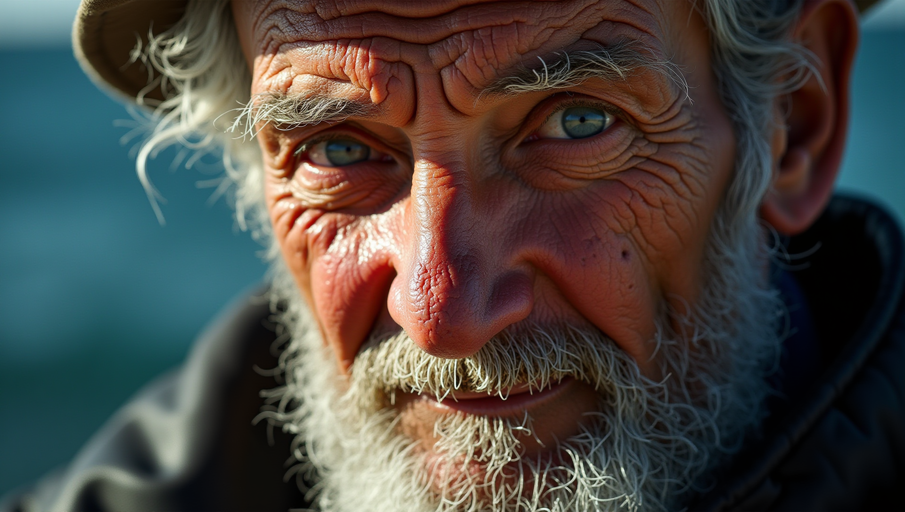
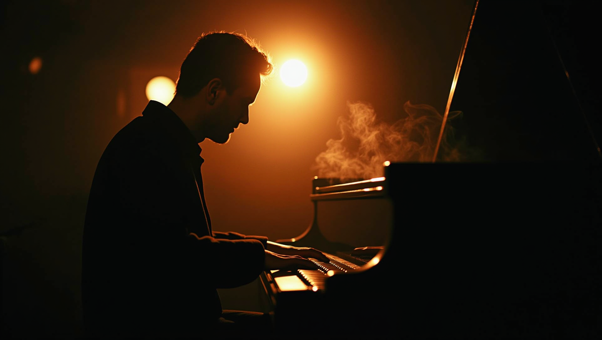
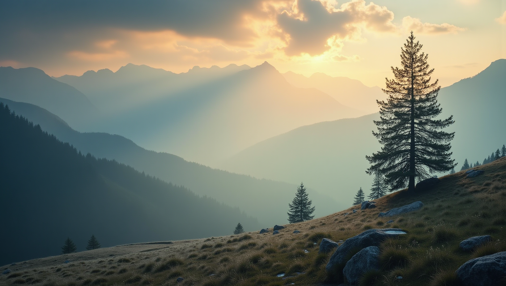
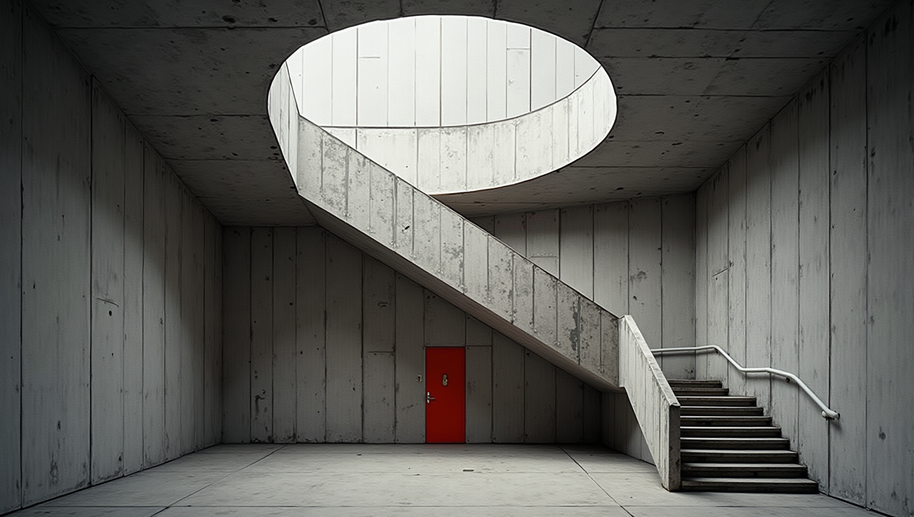
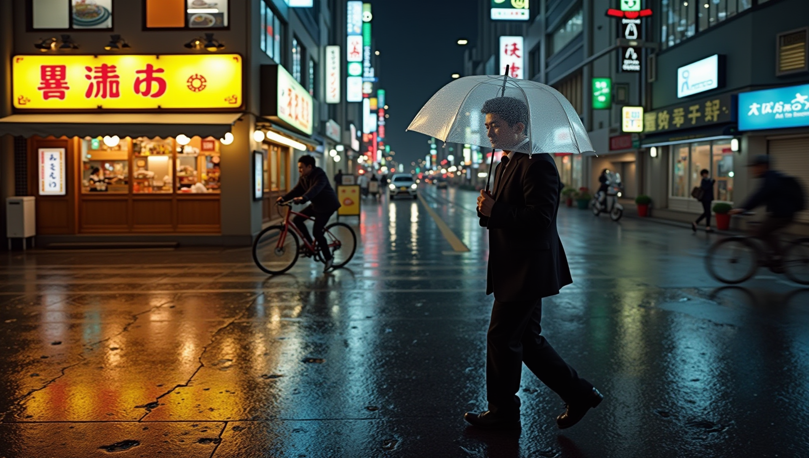
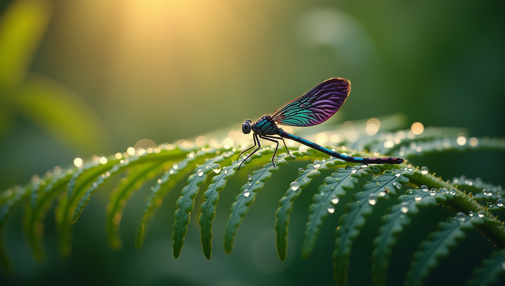
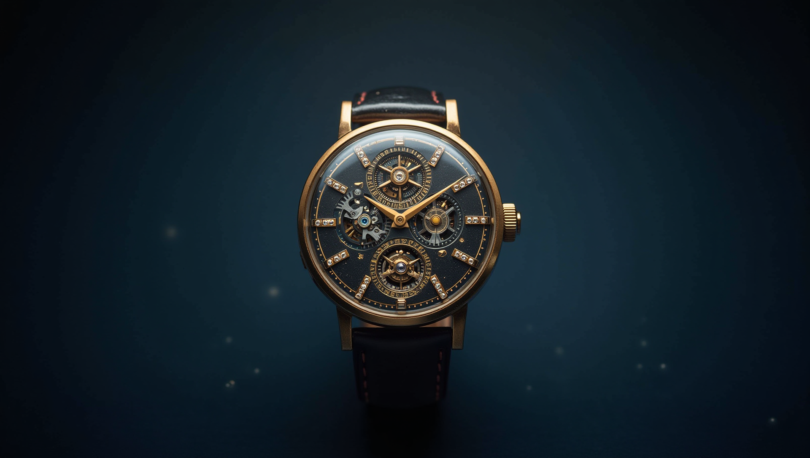
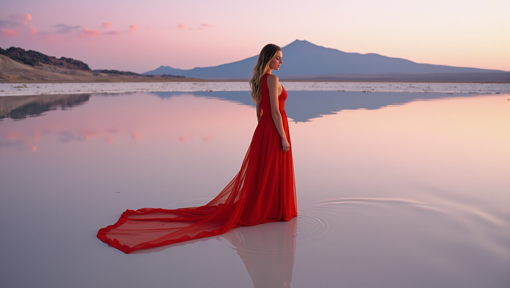
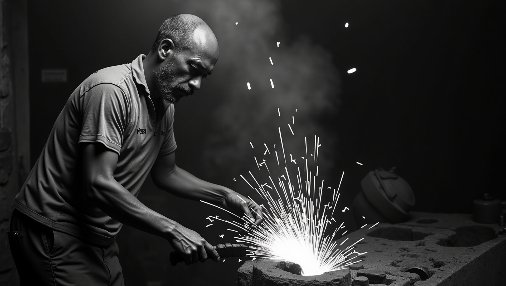
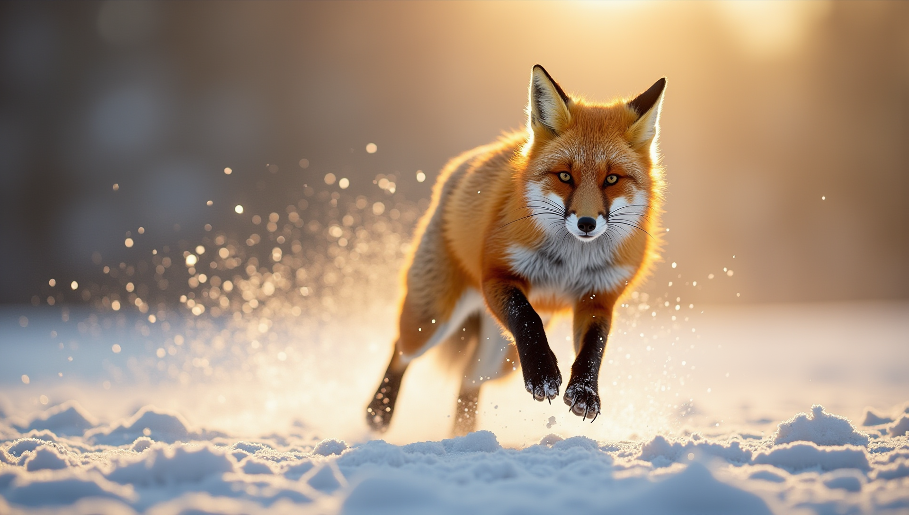

# FLUX1 Model & Workflow Tests für Fotografen

**Kurzbeschreibung:**
Dieses Dokument beschreibt das `flux1`-Modell und die durchgeführten Workflow-Tests mit ComfyUI, die sich an Fotografen richten. Es listet die verwendeten Prompts und Einstellungen auf und zeigt die resultierenden Ausgaben (Fotos) im Ordner `output_images`.

## Modellübersicht
- Name: `flux1-dev` ([black-forest-labs](https://huggingface.co/black-forest-labs/FLUX.1-dev))
- Zweck: Bild- und Fotostil-Generierung mit Fokus auf fotografische Parameter (Brennweite, Blende, Filmlook, Beleuchtung).
- Typ: Text-zu-Bild / Bildveredelungs-Workflow (kompositionell und farblich auf Fotografie abgestimmt).

## Workflow (Kurz)
1. Foto auswählen oder Ausgangsbild vorbereiten (falls verwendet).
2. Prompt formulieren: fotografische Beschreibung + Stil + Stimmung.
3. Modell-Settings setzen: Sampler, Steps, CFG-Scale, Seed, Auflösung etc.
4. Inferenz laufen lassen, Output prüfen, ggf. Variationen erzeugen.

## Dokumentation der Testläufe
Die folgenden Einträge dokumentieren jeweils: Dateiname, kurze Beschreibung, verwendeter Prompt, Einstellungen und das generierte Bild.

### 01_fisherman_portrait_00.png
- Beschreibung: Portrait eines Fischers im goldenen Abendlicht; natürlicher Filmlook.
- Prompt:
```
A close-up documentary portrait of an elderly fisherman, weathered skin with visible pores and deep wrinkles, salt-crusted grey beard, piercing blue eyes, harsh midday sunlight creating dramatic shadows, subsurface scattering on skin, natural skin oil and imperfections, shot on Kodak Portra 400, Hasselblad H6D with 80mm lens at f/2.8, unretouched photojournalism, slight film grain
```
- Einstellungen:
  - Sampler: `deis` | Scheduler: `simple`
  - Steps: `28` | Guidance: `2.5` | Denoise: `1.0`
  - Auflösung: `1920 × 1088`
- Output: 

### 02_jazz_pianist_lowlight_00.png
- Beschreibung: Pianist in gedimmtem Jazz-Club, Low-Light, warme Stimmung.
- Prompt:
```
A jazz pianist performing in a dimly lit underground club, single warm tungsten spotlight illuminating hands and keys, deep shadows, cigarette smoke drifting through the light beam, shot on Leica M11 with 50mm Summilux at f/1.4, ISO 3200, slight grain, Saul Leiter-inspired mood
```
- Einstellungen:
  - Sampler: `deis` | Scheduler: `simple`
  - Steps: `28` | Guidance: `2.5` | Denoise: `1.0`
  - Auflösung: `1920 × 1088`
- Output: 

### 03_alpine_sunrise_00.png
- Beschreibung: Landschaft bei Sonnenaufgang, weiches Licht, große Tiefenschärfe.
- Prompt:
```
Misty alpine valley at sunrise, layered mountain ridges fading into atmospheric haze, single shaft of golden light breaking through clouds onto a lone larch tree, frost on grass in foreground, shot on Phase One IQ4 150MP, 45mm lens, f/11, ultra-sharp foreground to infinity, large format detail
```
- Einstellungen:
  - Sampler: `deis` | Scheduler: `simple`
  - Steps: `28` | Guidance: `2.5` | Denoise: `1.0`
  - Auflösung: `1920 × 1088`
- Output: 

### 04_brutalist_architecture_00.png
- Beschreibung: Architektur-Foto in brutalistischem Stil, harte Schatten, klare Linien.
- Prompt:
```
Brutalist concrete staircase spiraling downward, geometric shadows from a single overhead skylight, monochromatic gray palette with one red door at the bottom, symmetrical composition, shot on Fujifilm GFX 100S, 23mm tilt-shift lens, architectural photography style reminiscent of Hélène Binet
```
- Einstellungen:
  - Sampler: `deis` | Scheduler: `simple`
  - Steps: `28` | Guidance: `2.5` | Denoise: `1.0`
  - Auflösung: `1920 × 1088`
- Output: 

### 05_tokyo_street_rain_00.png
- Beschreibung: Straßenaufnahme bei Regen, reflektierende Pfützen, Neonlichter.
- Prompt:
```
Tokyo rainy night in Shinjuku, neon reflections in wet asphalt, lone businessman with transparent umbrella walking past a ramen shop, motion blur on passing cyclist, shot on Ricoh GR III, 28mm, f/2.8, 1/30s, candid moment, Daido Moriyama atmosphere
```
- Einstellungen:
  - Sampler: `deis` | Scheduler: `simple`
  - Steps: `28` | Guidance: `2.5` | Denoise: `1.0`
  - Auflösung: `1920 × 1088`
- Output: 

### 06_damselfly_macro_00.png
- Beschreibung: Makroaufnahme einer Libelle, sehr feine Details, geringe Schärfentiefe.
- Prompt:
```
Extreme macro of a damselfly perched on a dewdrop-covered fern, iridescent wings catching morning light, shallow depth of field with creamy bokeh, water droplets acting as tiny lenses, shot on Canon EOS R5 with MP-E 65mm at 3x magnification, f/8, focus stacked, scientific clarity
```
- Einstellungen:
  - Sampler: `deis` | Scheduler: `simple`
  - Steps: `28` | Guidance: `2.5` | Denoise: `1.0`
  - Auflösung: `1920 × 1088`
- Output: 

### 07_watch_product_00.png
- Beschreibung: Produktfoto einer Armbanduhr auf neutralem Hintergrund, detailorientiert.
- Prompt:
```
A vintage mechanical wristwatch floating against a deep navy background, dramatic chiaroscuro lighting from a single softbox at 45 degrees, exposed gears and jewels visible through sapphire crystal, microscopic dust particles, shot on Sony A1 with 90mm macro at f/11, commercial product photography
```
- Einstellungen:
  - Sampler: `deis` | Scheduler: `simple`
  - Steps: `28` | Guidance: `2.5` | Denoise: `1.0`
  - Auflösung: `1920 × 1088`
- Output: 

### 08_salt_lake_surreal_00.png
- Beschreibung: Surreale Landschaft am Salzsee bei Sonnenuntergang, starke Farben.
- Prompt:
```
A woman in a flowing red silk dress standing knee-deep in a mirror-still salt lake at twilight, perfect reflection doubling her form, distant volcano on horizon, dreamlike pastel sky transitioning from lavender to peach, shot on medium format film, Tim Walker editorial style
```
- Einstellungen:
  - Sampler: `deis` | Scheduler: `simple`
  - Steps: `28` | Guidance: `2.5` | Denoise: `1.0`
  - Auflösung: `1920 × 1088`
- Output: 

### 09_blacksmith_bw_00.png
- Beschreibung: Schwarzweiß-Portrait eines Schmieds, dramatische Beleuchtung.
- Prompt:
```
Black and white documentary photograph of a blacksmith mid-strike, sparks flying from glowing orange metal, smoke and soot in the air, deeply contrasted lighting from forge fire, sweat-glistened arms, shot on Tri-X 400 pushed to 1600, Leica M6 with 35mm Summicron, Sebastião Salgado aesthetic
```
- Einstellungen:
  - Sampler: `deis` | Scheduler: `simple`
  - Steps: `28` | Guidance: `2.5` | Denoise: `1.0`
  - Auflösung: `1920 × 1088`
- Output: 

### 10_fox_action_00.png
- Beschreibung: Actionaufnahme eines Fuchses in Bewegung, dynamische Komposition.
- Prompt:
```
A red fox leaping mid-air across a snow-covered meadow, snow crystals suspended in the air around its paws, breath visible as vapor, bright winter sun backlighting the scene creating a rim light on fur, shot on Nikon Z9 with 600mm f/4 at 1/2000s, wildlife photography, tack sharp on the eyes
```
- Einstellungen:
  - Sampler: `deis` | Scheduler: `simple`
  - Steps: `28` | Guidance: `2.5` | Denoise: `1.0`
  - Auflösung: `1920 × 1088`
- Output: 

## Hinweise zur Reproduktion
- Variieren Sie `Guidance` für stärker oder schwächer ausgeprägte Stilvorgaben.
- Verwenden Sie einen festen `noise_seed` in `flux1_dev.json` (Node `25`), um reproduzierbare Ergebnisse zu erzielen.

## Vorschläge für Fotografen
- Testen Sie unterschiedliche Brennweiten/Blenden im Prompt, um gewünschte Bokeh- und Tiefenwirkung zu erzielen.
- Verwenden Sie Film- oder Kameramodel-Keywords (z. B. "Kodak Portra", "Leica M"), um spezifische Looks zu favorisieren.

---
Siehe auch [FLUX2](https://github.com/nyffenr/flux2-examples) Repo